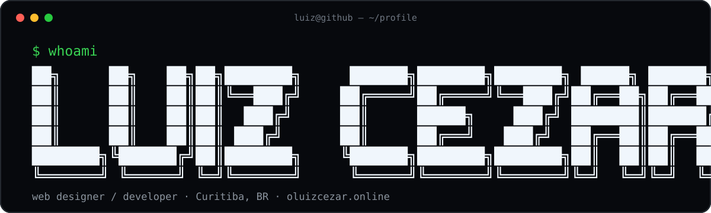
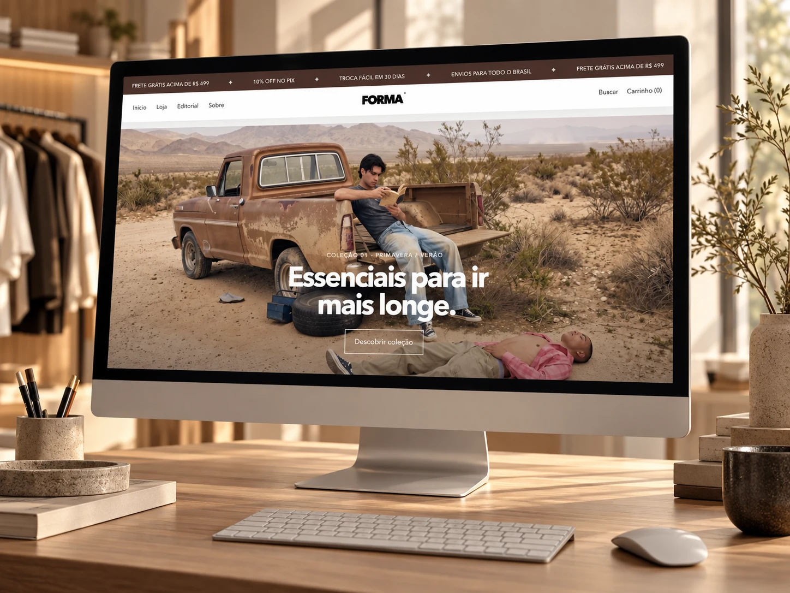
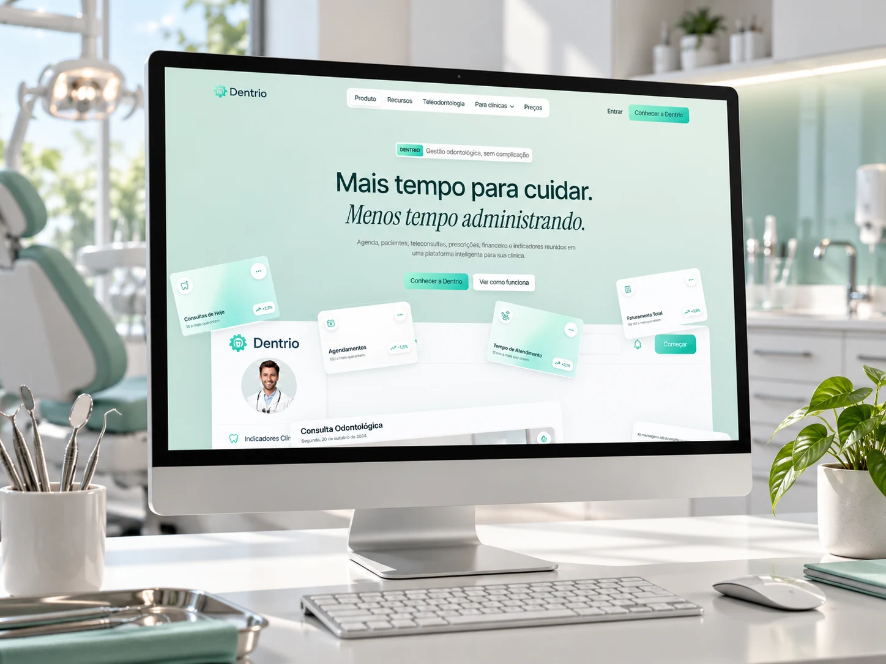
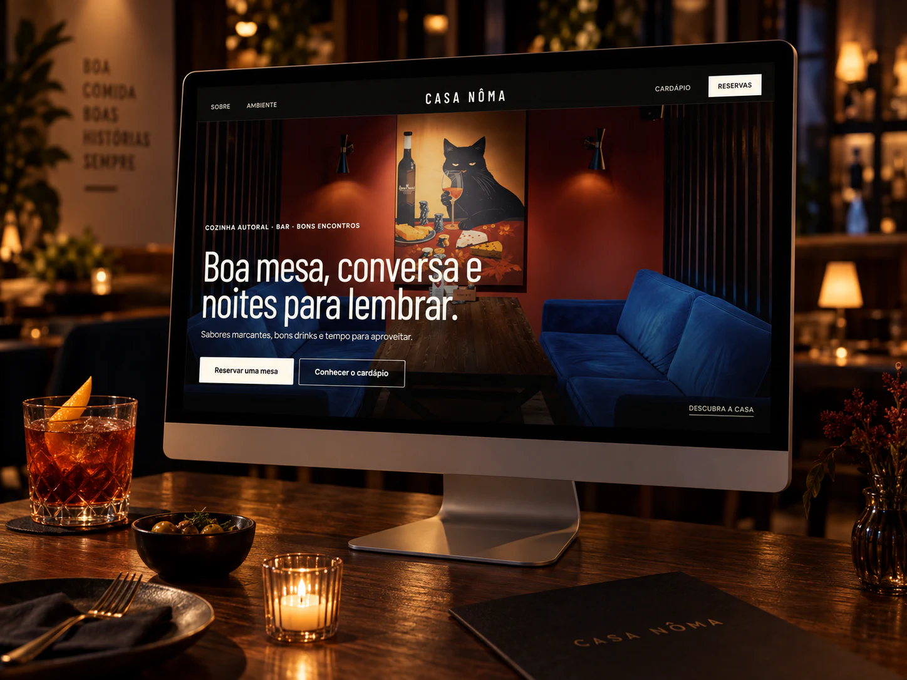
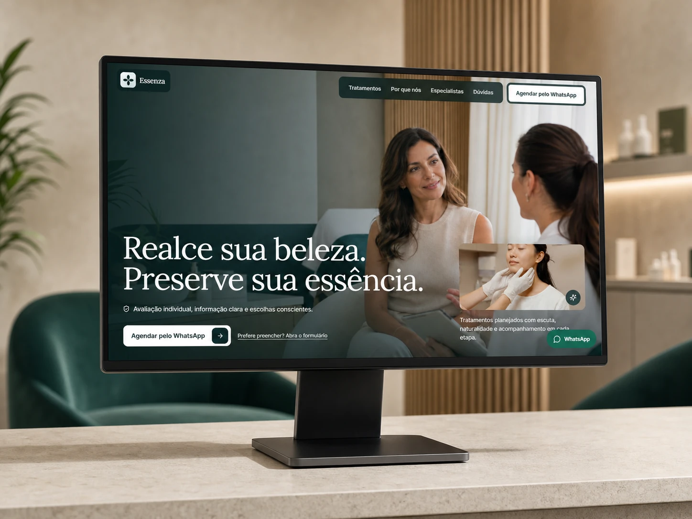
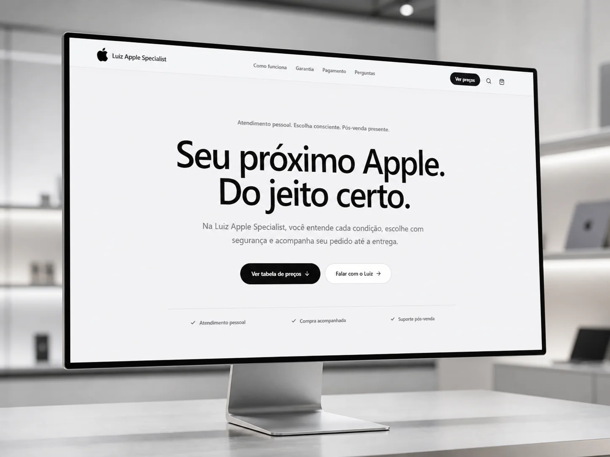

<div align="center">



<a href="https://git.io/typing-svg"></a>

[](https://www.oluizcezar.online)
[](https://www.oluizcezar.online/curriculo)
[](https://instagram.com/o.luizcezar)
[](https://wa.me/5541991512510)

</div>

```javascript
const luiz = {
  role: "Web Designer + Developer",
  basedIn: "Curitiba, BR",
  experience: "8+ years",
  work: ["Sites", "Landing Pages", "E-commerce", "Portfolios", "Web Apps"],
  focus: ["Design", "Development", "Digital Strategy"],
  portfolio: "https://www.oluizcezar.online"
};
```

### `>_ ./about`

Eu transformo negócios em experiências digitais claras, rápidas e bem apresentadas. Cuido da **estrutura, do design e do desenvolvimento** — do primeiro wireframe ao projeto publicado.

Minha prioridade não é só deixar bonito: é fazer a interface explicar melhor o negócio, facilitar a navegação e levar a pessoa ao próximo passo.

### `>_ ./stack`

<div align="center">


</div>

### `>_ ls ./featured-work`

<table>
<tr>
<td width="50%" valign="top">
<a href="https://www.oluizcezar.online/#projetos"></a>
<br><br>
<b><code>01</code> Prestige / FORMA</b><br>
<sub>Loja editorial de moda com catálogo, páginas de produto e carrinho em uma experiência minimalista.</sub><br><br>
<a href="https://www.oluizcezar.online/#projetos"><b>[ OPEN PROJECT ↗ ]</b></a>
</td>
<td width="50%" valign="top">
<a href="https://dentrio.vercel.app/"></a>
<br><br>
<b><code>04</code> Dentrio</b><br>
<sub>Landing page para uma plataforma de gestão odontológica, com apresentação do produto e agendamento de demonstração.</sub><br><br>
<a href="https://dentrio.vercel.app/"><b>[ OPEN PROJECT ↗ ]</b></a>
</td>
</tr>
<tr>
<td width="50%" valign="top">
<a href="https://casanoma.vercel.app/"></a>
<br><br>
<b><code>07</code> Casa Nôma</b><br>
<sub>Experiência digital para apresentar cozinha, ambiente e cardápio e transformar visitas em reservas.</sub><br><br>
<a href="https://casanoma.vercel.app/"><b>[ OPEN PROJECT ↗ ]</b></a>
</td>
<td width="50%" valign="top">
<a href="https://firstchoicelaw.vercel.app/"></a>
<br><br>
<b><code>09</code> First Choice Law</b><br>
<sub>Site institucional bilíngue para apresentar equipe, áreas de atuação, resultados e facilitar o primeiro contato.</sub><br><br>
<a href="https://firstchoicelaw.vercel.app/"><b>[ OPEN PROJECT ↗ ]</b></a>
</td>
</tr>
<tr>
<td width="50%" valign="top">
<a href="https://esteticacwb.vercel.app/"></a>
<br><br>
<b><code>15</code> Essenza</b><br>
<sub>Site para clínica de estética com tratamentos, especialistas e agendamento direto pelo WhatsApp.</sub><br><br>
<a href="https://esteticacwb.vercel.app/"><b>[ OPEN PROJECT ↗ ]</b></a>
</td>
<td width="50%" valign="top">
<a href="https://www.luiziphones.shop/"></a>
<br><br>
<b><code>21</code> Luiz Apple</b><br>
<sub>Catálogo de produtos Apple com condições de compra e atendimento direto pelo WhatsApp.</sub><br><br>
<a href="https://www.luiziphones.shop/"><b>[ OPEN PROJECT ↗ ]</b></a>
</td>
</tr>
</table>

<div align="center">

**[ VIEW FULL PORTFOLIO → ](https://www.oluizcezar.online/#projetos)**

</div>

<details>
<summary><b><code>>_ ls ./all-projects --all</code> &nbsp; 24 projetos</b></summary>
<br>
<table>
<tr>
<td width="50%" valign="top"><code>01</code> <b>Prestige / FORMA</b><br><sub>Loja editorial de moda com catálogo, páginas de produto e carrinho em uma experiência minimalista.</sub><br><a href="https://www.oluizcezar.online/#projetos">open ↗</a></td>
<td width="50%" valign="top"><code>02</code> <b>Ultimate / VANTA</b><br><sub>Loja de streetwear com entrada imersiva, catálogo, produto e carrinho em uma linguagem visual escura.</sub><br><a href="https://www.oluizcezar.online/#projetos">open ↗</a></td>
</tr>
<tr>
<td width="50%" valign="top"><code>03</code> <b>Crack</b><br><sub>Loja experimental com drops, coleções e editorial inspirado em música, rua e cultura independente.</sub><br><a href="https://crackstore.vercel.app/">open ↗</a></td>
<td width="50%" valign="top"><code>04</code> <b>Dentrio</b><br><sub>Landing page para uma plataforma de gestão odontológica, com apresentação do produto e agendamento de demonstração.</sub><br><a href="https://dentrio.vercel.app/">open ↗</a></td>
</tr>
<tr>
<td width="50%" valign="top"><code>05</code> <b>Cabus Pet</b><br><sub>Site para apresentar serviços de pet shop e facilitar o agendamento de consultas, banho e tosa.</sub><br><a href="https://cabuspet.vercel.app/">open ↗</a></td>
<td width="50%" valign="top"><code>06</code> <b>Olívia &amp; Daniel</b><br><sub>Convite digital com história do casal, programação, informações para convidados e confirmação de presença.</sub><br><a href="https://www.oluizcezar.online/#projetos">open ↗</a></td>
</tr>
<tr>
<td width="50%" valign="top"><code>07</code> <b>Casa Nôma</b><br><sub>Experiência digital para apresentar cozinha, ambiente e cardápio e transformar visitas em reservas.</sub><br><a href="https://casanoma.vercel.app/">open ↗</a></td>
<td width="50%" valign="top"><code>08</code> <b>Amrit Palace</b><br><sub>Site editorial para apresentar a tradição da casa, o cardápio, eventos e reservas.</sub><br><a href="https://amritpalace.vercel.app/">open ↗</a></td>
</tr>
<tr>
<td width="50%" valign="top"><code>09</code> <b>First Choice Law</b><br><sub>Site institucional bilíngue para apresentar equipe, áreas de atuação, resultados e facilitar o primeiro contato.</sub><br><a href="https://firstchoicelaw.vercel.app/">open ↗</a></td>
<td width="50%" valign="top"><code>10</code> <b>Happy</b><br><sub>Experiência digital para apresentar cardápio, identidade da marca e facilitar pedidos.</sub><br><a href="https://hamburguerhappy.vercel.app/">open ↗</a></td>
</tr>
<tr>
<td width="50%" valign="top"><code>11</code> <b>Amici</b><br><sub>Site editorial para apresentar gastronomia, unidades e transformar visitas em reservas.</sub><br><a href="https://amici-nu.vercel.app/">open ↗</a></td>
<td width="50%" valign="top"><code>12</code> <b>Casa Maria</b><br><sub>Identidade digital com linguagem editorial para apresentar a casa, o cardápio e receber reservas.</sub><br><a href="https://odemaria.vercel.app/">open ↗</a></td>
</tr>
<tr>
<td width="50%" valign="top"><code>13</code> <b>Meguro Café</b><br><sub>Site editorial com cardápio, horários e a atmosfera da casa apresentados de forma direta.</sub><br><a href="https://megurocafe.vercel.app/">open ↗</a></td>
<td width="50%" valign="top"><code>14</code> <b>Forneria</b><br><sub>Site para pizzaria artesanal com cardápio, reservas e apresentação direta dos produtos.</sub><br><a href="https://apizzaria.vercel.app/">open ↗</a></td>
</tr>
<tr>
<td width="50%" valign="top"><code>15</code> <b>Essenza</b><br><sub>Site para clínica de estética com tratamentos, especialistas e agendamento direto pelo WhatsApp.</sub><br><a href="https://esteticacwb.vercel.app/">open ↗</a></td>
<td width="50%" valign="top"><code>16</code> <b>Luz e Câmera</b><br><sub>Portfólio audiovisual para apresentar ensaios e filmes com foco nas imagens e nas histórias de cada casal.</sub><br><a href="https://luzecamera.vercel.app/">open ↗</a></td>
</tr>
<tr>
<td width="50%" valign="top"><code>17</code> <b>Motel Caribe</b><br><sub>Apresentação das suítes, diferenciais e canais de reserva em uma navegação simples.</sub><br><a href="https://motelcaribe.vercel.app/">open ↗</a></td>
<td width="50%" valign="top"><code>18</code> <b>Ilana Santiago</b><br><sub>Portfólio de arquitetura com foco nos projetos, no repertório e na apresentação do escritório.</sub><br><a href="https://www.oluizcezar.online/#projetos">open ↗</a></td>
</tr>
<tr>
<td width="50%" valign="top"><code>19</code> <b>FNS Cups</b><br><sub>Loja online com catálogo organizado e uma jornada de compra simples, do produto ao checkout.</sub><br><a href="https://www.oluizcezar.online/#projetos">open ↗</a></td>
<td width="50%" valign="top"><code>20</code> <b>GT Capital</b><br><sub>Site institucional para apresentar a empresa, os serviços e facilitar novos contatos.</sub><br><a href="https://www.oluizcezar.online/#projetos">open ↗</a></td>
</tr>
<tr>
<td width="50%" valign="top"><code>21</code> <b>Luiz Apple</b><br><sub>Catálogo de produtos Apple com condições de compra e atendimento direto pelo WhatsApp.</sub><br><a href="https://www.luiziphones.shop/">open ↗</a></td>
<td width="50%" valign="top"><code>22</code> <b>Mysa Atelier</b><br><sub>Site para apresentar serviços, diferenciais e transformar o interesse em agendamentos.</sub><br><a href="https://mysahair.vercel.app/">open ↗</a></td>
</tr>
<tr>
<td width="50%" valign="top"><code>23</code> <b>Swadisht</b><br><sub>Site de restaurante com apresentação da casa, cardápio e acesso rápido às reservas.</sub><br><a href="https://swadishtcuisine.vercel.app/">open ↗</a></td>
<td width="50%" valign="top"><code>24</code> <b>Soberbo</b><br><sub>Site institucional para destacar gastronomia, ambientes, eventos e os canais de reserva da casa.</sub><br><a href="https://soberbo.vercel.app/">open ↗</a></td>
</tr>
</table>
</details>

### `>_ ./contact --start-project`

```text
┌──────────────────────────────────────────────────────────────┐
│ Precisa de um site, landing page, loja virtual ou web app?  │
│                                                            │
│ portfolio  →  oluizcezar.online                            │
│ instagram  →  @o.luizcezar                                │
│ location   →  Curitiba / PR                                │
└──────────────────────────────────────────────────────────────┘
```

<div align="center">

### [oluizcezar.online ↗](https://www.oluizcezar.online)

`design / code / strategy / web`

</div>
